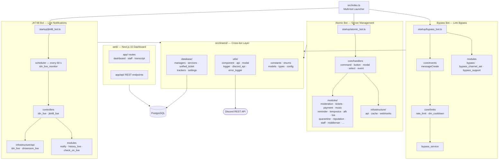
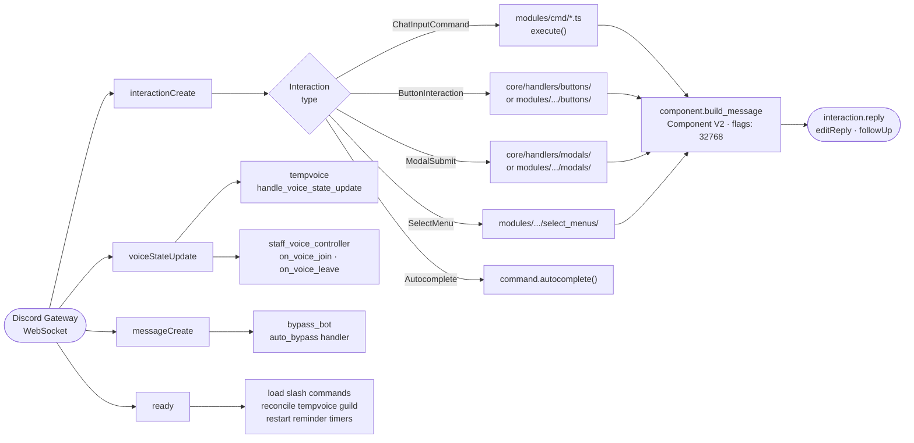
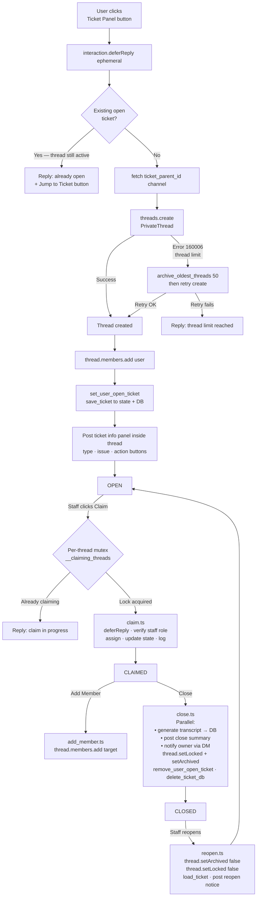
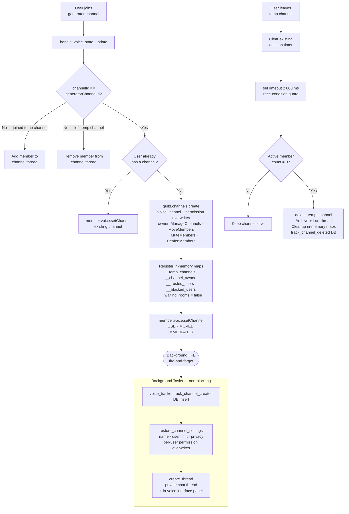
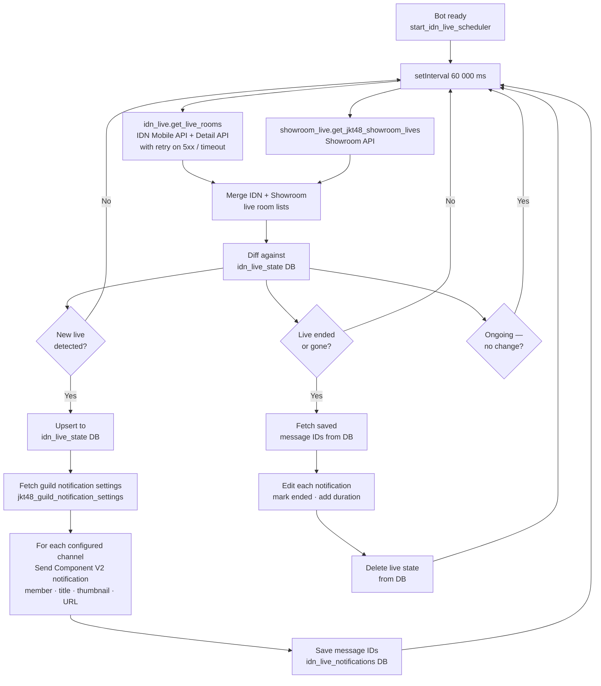

<div align="center">

<table border="0" cellspacing="0" cellpadding="0">
  <tr>
    <td valign="middle">
      
    </td>
    <td valign="middle" width="24"></td>
    <td valign="middle">
      
    </td>
  </tr>
</table>

<p>A multi-bot Discord platform for server management, automation,<br/>JKT48 live notifications, and link bypassing.</p>

[](https://github.com/bimoraa/atomic_bot/commits/main)
[](https://nodejs.org)
[](https://www.typescriptlang.org)
[](https://discord.js.org)
[](https://www.postgresql.org)
[](LICENSE.txt)

</div>

---

## Overview

| Bot | Description |
|---|---|
| **Atomic Bot** | Main server management — moderation, tickets, payments, music, reminders, and more |
| **JKT48 Bot** | Live stream notifications for JKT48 IDN & Showroom streams |
| **Bypass Bot** | Automatic link bypassing with DM and channel support |

---

## Architecture



---

## Interaction Routing



---

## Ticket System Lifecycle



---

## TempVoice Channel Lifecycle



---

## JKT48 Live Notification Loop



---

## Bypass Bot — Link Processing Pipeline

```mermaid
flowchart LR
    MSG_EV["messageCreate"]

    MSG_EV --> PARTIAL{"partial\nmessage?"}
    PARTIAL -->|"Yes"| FETCH_P["message.fetch()"]
    PARTIAL -->|"No"| CHAN_CHK
    FETCH_P --> CHAN_CHK

    CHAN_CHK{"DM or\nconfigured\nbypass channel?"}
    CHAN_CHK -->|"Neither"| IGN["skip"]
    CHAN_CHK -->|"bypass_enabled = false"| MAINT["Reply: Under Maintenance\n+ disabled reason"]
    CHAN_CHK -->|"Is DM"| DM_COOL{"DM cooldown\nactive?"}
    CHAN_CHK -->|"Is Channel"| G_RATE{"Guild rate\nlimit hit?"}

    DM_COOL -->|"Yes — silent drop"| DROP["skip\navoid bot quarantine"]
    DM_COOL -->|"No"| EXTR
    G_RATE  -->|"Yes"| RATE_R["Reply: rate limit\n+ wait seconds"]
    G_RATE  -->|"No"| EXTR

    EXTR["extract_url_from_message\ncontent → embed.url\n→ embed.description → embed.fields"]
    EXTR --> URL_CHK{"URL\nfound?"}
    URL_CHK -->|"No"| IGN2["skip"]
    URL_CHK -->|"Yes"| PROC_R["Reply: Bypassing Link\n+ DM install button"]

    PROC_R --> TRACK["track_bypass_session\nDB upsert — restart recovery"]
    TRACK  --> BP_CALL["bypass_service.bypass_link\nwith retry callback"]

    BP_CALL -->|"Success"| OK_R["Edit reply:\nbypassed URL + Copy buttons"]
    BP_CALL -->|"Failed"| FAIL_R["Edit reply:\nerror + retry suggestion"]

    OK_R   --> CLRDB["clear_bypass_session\nDB delete"]
    FAIL_R --> CLRDB

    subgraph RECOVER["On Bot Restart"]
        direction LR
        RCV1["Query bypass_cache\nfor stuck sessions"]
        RCV2["Fetch each stuck message\nEdit: Bot Restarted notice"]
        RCV3["Delete session\nfrom bypass_cache"]
        RCV1 --> RCV2 --> RCV3
    end
```



---

## Prerequisites

- Node.js >= 20.19.0
- npm >= 10.0.0
- PostgreSQL database
- Discord Bot Token(s)

## Installation

```bash
# Install dependencies
npm install

# Configure environment
cp .env.example .env

# Build
npm run build
```

## Running

```bash
# All bots at once
npm start

# Or individually
npm run start:atomic
npm run start:jkt48
npm run start:bypass
```

## Development

```bash
# All bots (watch mode)
npm run dev:all

# Individual
npm run dev:atomic
npm run dev:jkt48
npm run dev:bypass
```

## Project Structure

```
src/
├── index.ts                  # Multi-bot launcher
│
├── startup/                  # Per-bot entry points
│   ├── atomic_bot.ts
│   ├── jkt48_bot.ts
│   └── bypass_bot.ts
│
├── atomic_bot/               # Main server management bot
│   ├── core/
│   │   ├── client/
│   │   ├── handlers/
│   │   └── middleware/
│   ├── guide/                # Guide markdown files
│   ├── infrastructure/
│   │   ├── api/
│   │   ├── cache/
│   │   └── webhooks/
│   └── modules/
│       ├── moderation/       # Ban, kick, warn, mute
│       ├── music/            # DisTube playback
│       ├── tickets/          # Support ticket system
│       ├── payments/         # Payment handling
│       ├── reminder/         # Persistent reminders
│       ├── reputation/       # Rep system
│       ├── staff/            # Staff tools
│       ├── utility/          # General utilities
│       ├── whitelister/      # Whitelist management
│       └── ...
│
├── jkt48_bot/                # JKT48 live notification bot
│   ├── core/
│   │   ├── buttons/
│   │   ├── controllers/
│   │   └── schedulers/
│   ├── infrastructure/api/
│   └── modules/
│       ├── notify.ts
│       ├── notify_channel_set.ts
│       ├── history_live.ts
│       └── ...
│
├── bypass_bot/               # Link bypass bot
│   ├── core/
│   │   ├── buttons/
│   │   ├── events/           # Auto-bypass (DM + channel)
│   │   ├── limits/           # Rate limiting
│   │   └── select_menus/
│   └── modules/
│       ├── bypass.ts
│       ├── bypass_channel_set.ts
│       └── ...
│
├── shared/                   # Shared across all bots
│   ├── config/
│   ├── constants/
│   ├── database/
│   ├── services/
│   ├── types/
│   └── utils/
│
└── web/                      # Dashboard (Next.js)
    ├── app/
    └── components/
```

## Tech Stack

| Technology | Purpose |
|---|---|
| TypeScript | Language |
| Discord.js v14 | Discord API |
| Node.js | Runtime |
| PostgreSQL (`pg`) | Primary database |
| Express | Web server |
| Next.js | Web dashboard |
| DisTube | Music playback |
| concurrently | Multi-bot runner |

---

## License

MIT License — see [LICENSE.txt](LICENSE.txt)

---

<div align="center">

Made with Love by **Atomic Team (AZure48)**<br/>
Developed by Lendowsky, Kim7, kimsoyoun_

</div>
