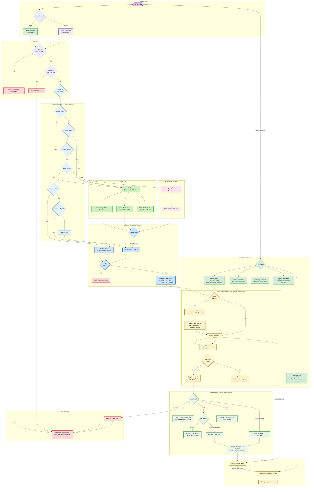

```mermaid
flowchart TD
    %% Styling
    classDef user      fill:#e1bee7,stroke:#7b1fa2,stroke-width:2px,color:#000
    classDef command   fill:#d4edda,stroke:#28a745,stroke-width:2px,color:#000
    classDef detect    fill:#e3f2fd,stroke:#1565c0,stroke-width:2px,color:#000
    classDef spotify   fill:#d0f0c0,stroke:#1DB954,stroke-width:2px,color:#000
    classDef apple     fill:#fce4ec,stroke:#c2185b,stroke-width:2px,color:#000
    classDef youtube   fill:#fce8cd,stroke:#cc0000,stroke-width:2px,color:#000
    classDef lavalink  fill:#cce5ff,stroke:#0056b3,stroke-width:2px,color:#000
    classDef queue     fill:#fff3cd,stroke:#856404,stroke-width:2px,color:#000
    classDef player    fill:#e8f5e9,stroke:#2e7d32,stroke-width:2px,color:#000
    classDef error     fill:#f8d7da,stroke:#dc3545,stroke-width:2px,color:#000
    classDef prefix    fill:#ede7f6,stroke:#4527a0,stroke-width:2px,color:#000

    User([User / Member]):::user

    %% ========================= COMMAND INPUT ========================= %%
    subgraph Input [Command Input]
        I1{Input Method?}
        I2["Slash Command\n/play query"]:::command
        I3["Prefix Command\na!play query"]:::prefix

        User --> I1
        I1 -- /play --> I2
        I1 -- a!play --> I3
    end

    %% ========================= VALIDATION ========================= %%
    subgraph Validation [Validation]
        V1{User in\nVoice Channel?}
        V2{Queue not\nfull? max 100}

        I2 --> V1
        I3 --> V1
        V1 -- No --> Err1[Reject: Join a voice channel first]:::error
        V1 -- Yes --> V2
        V2 -- No --> Err2[Reject: Queue is full]:::error
        V2 -- Yes --> PD1
    end

    %% ========================= PLATFORM DETECTION ========================= %%
    subgraph PlatformDetect [Platform Detection — detect_platform]
        PD1{Detect URL\nor Query?}:::detect
        PD2{Spotify Track?}:::detect
        PD3{Spotify Album?}:::detect
        PD4{Spotify Playlist?}:::detect
        PD5{Apple Music?}:::detect
        PD6{YouTube URL?}:::detect
        PD7{YouTube Playlist?}:::detect
        PD8[Search Query]:::detect

        PD1 --> PD2
        PD2 -- No --> PD3
        PD3 -- No --> PD4
        PD4 -- No --> PD5
        PD5 -- No --> PD6
        PD6 -- No --> PD7
        PD7 -- No --> PD8
    end

    %% ========================= SPOTIFY BRANCH ========================= %%
    subgraph Spotify [Spotify API]
        SP1[Get Token\nClient Credentials Flow]:::spotify
        SP2[Fetch Single Track Metadata]:::spotify
        SP3[Fetch Album Tracks\npaginated up to 100]:::spotify
        SP4[Fetch Playlist Tracks\npaginated up to 100]:::spotify

        PD2 -- Yes --> SP1 --> SP2
        PD3 -- Yes --> SP1 --> SP3
        PD4 -- Yes --> SP1 --> SP4
    end

    %% ========================= APPLE MUSIC BRANCH ========================= %%
    subgraph Apple [Apple Music Scraper]
        AM1["Scrape og:title and og:description"]:::apple
        AM2[Parse Track Title & Artist]:::apple

        PD5 -- Yes --> AM1 --> AM2
    end

    %% ========================= LAVALINK RESOLUTION ========================= %%
    subgraph Lavalink [Lavalink / Shoukaku Resolution]
        LV1{Source Type?}:::lavalink
        LV2[Direct Resolve\nYouTube URL / ytplaylist]:::lavalink
        LV3[ytsearch: title + author]:::lavalink
        LV4{Track\nFound?}:::lavalink
        LV5[Build track_data Object\nencoded + title + author\n+ duration + uri + artwork]:::lavalink

        SP2 --> LV1
        SP3 --> LV1
        SP4 --> LV1
        AM2 --> LV1
        PD6 -- Yes --> LV2 --> LV4
        PD7 -- Yes --> LV2 --> LV4
        PD8 --> LV3 --> LV4
        LV1 -- Metadata List --> LV3
        LV4 -- No --> Err3[Notify: No results found]:::error
        LV4 -- Yes --> LV5
    end

    %% ========================= QUEUE MANAGEMENT ========================= %%
    subgraph Queue [Guild Queue Management — guild_queues Map]
        Q1{Player\nExists?}:::queue
        Q2[Join Voice Channel\nshoukaku.joinVoiceChannel]:::queue
        Q3[Attach Player Events\nstart / end / stuck / exception / closed]:::queue
        Q4[Add Track\nto guild_queue.tracks]:::queue
        Q5{Queue was\nEmpty?}:::queue
        Q6[Play Immediately\nplayer.playTrack]:::queue
        Q7[Enqueued\nNotify position in queue]:::queue
        Q8[Cancel Idle Timer\nif running]:::queue

        LV5 --> Q1
        Q1 -- No --> Q2 --> Q3 --> Q8 --> Q4
        Q1 -- Yes --> Q8 --> Q4
        Q4 --> Q5
        Q5 -- Yes --> Q6
        Q5 -- No --> Q7
    end

    %% ========================= PLAYER EVENTS ========================= %%
    subgraph PlayerEvents [Player Events — setup_player_events]
        PE1{Event Type?}:::player
        PE2[start → Send Now Playing\nbuild_now_playing_message]:::player
        PE3{end reason?}:::player
        PE4[replaced → do nothing\n skip already handled]:::player
        PE5[finished → play_next]:::player
        PE6[play_next: dequeue & playTrack\nor start idle timer if empty]:::player
        PE7[stuck / exception → play_next]:::player
        PE8[closed → clear queue & guild_queues]:::player

        Q6 --> PE1
        PE1 -- start --> PE2
        PE1 -- end --> PE3
        PE3 -- replaced --> PE4
        PE3 -- finished/loadFailed --> PE5 --> PE6
        PE1 -- stuck/exception --> PE7 --> PE6
        PE1 -- closed --> PE8
    end

    %% ========================= IDLE TIMER ========================= %%
    subgraph IdleTimer [Idle Handling]
        IT1[Start 5-min Idle Timer]:::queue
        IT2[shoukaku.leaveVoiceChannel]:::queue
        IT3[Clear guild_queues entry]:::queue

        PE6 --> IT1
        IT1 -->|timeout after 5 min| IT2 --> IT3
        Q8 -->|new track added| IT1
    end

    %% ========================= CONTROL COMMANDS ========================= %%
    subgraph Controls [Control Commands]
        C1{Command?}:::command
        C2["/skip or a!skip\nremove N tracks\nplayTrack next or stopTrack"]:::command
        C3["/stop or a!stop\nstopTrack + leaveVoiceChannel\nclear queue"]:::command
        C4["/pause or a!pause\nplayer.setPaused true"]:::command
        C5["/resume or a!resume\nplayer.setPaused false"]:::command
        C6["/queue or a!queue\nbuild_queue_message paginated"]:::command

        User -->|other commands| C1
        C1 --> C2
        C1 --> C3
        C1 --> C4
        C1 --> C5
        C1 --> C6

        C2 --> Queue
        C3 --> IT2
    end

    %% ========================= ERROR HANDLING ========================= %%
    subgraph ErrorHandling [Error Handling]
        EH1[catch err → log_error]:::error
        EH2[editReply / message.edit\nerror message Component V2]:::error
    end

    Err1 --> EH2
    Err2 --> EH2
    Err3 --> EH2
    PE1 -->|exception| EH1 --> EH2
```
