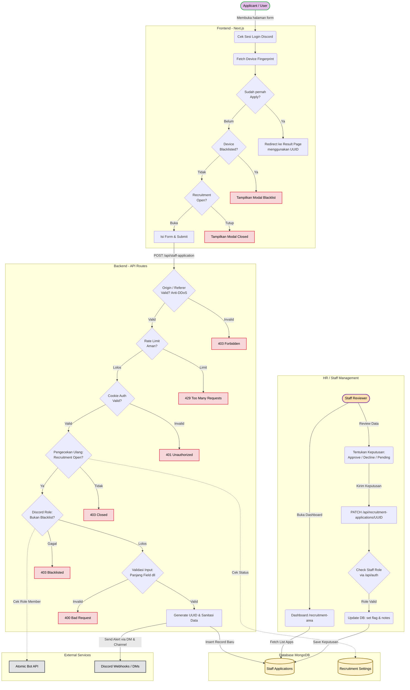

```mermaid
flowchart TD
    %% Styling
    classDef user fill:#e1bee7,stroke:#28a745,stroke-width:2px,color:#000
    classDef frontend fill:#d4edda,stroke:#28a745,stroke-width:2px,color:#000
    classDef backend fill:#cce5ff,stroke:#0056b3,stroke-width:2px,color:#000
    classDef database fill:#fff3cd,stroke:#856404,stroke-width:2px,color:#000
    classDef bot fill:#e2e3e5,stroke:#383d41,stroke-width:2px,color:#000
    classDef error fill:#f8d7da,stroke:#dc3545,stroke-width:2px,color:#000
    classDef hr fill:#ffe0b2,stroke:#6a1b9a,stroke-width:2px,color:#000

    User([Applicant / User]):::user -->|Membuka halaman form| F1

    %% ================= FRONTEND ================= %%
    subgraph Frontend [Frontend - Next.js]
        F1(Cek Sesi Login Discord)
        F2(Fetch Device Fingerprint)
        
        F3{Sudah pernah<br>Apply?}
        F4{Device<br>Blacklisted?}
        F5{Recruitment<br>Open?}
        
        F6[Isi Form & Submit]
        F7[Redirect ke Result Page<br>menggunakan UUID]
        
        F1 --> F2 --> F3
        F3 -- Ya --> F7
        F3 -- Belum --> F4
        F4 -- Ya --> Err1[Tampilkan Modal Blacklist]:::error
        F4 -- Tidak --> F5
        F5 -- Tutup --> Err2[Tampilkan Modal Closed]:::error
        F5 -- Buka --> F6
    end

    F6 -->|POST /api/staff-application| B1

    %% ================= BACKEND ================= %%
    subgraph Backend [Backend - API Routes]
        B1{Origin / Referer<br>Valid? Anti-DDoS}
        B2{Rate Limit<br>Aman?}
        B3{Cookie Auth<br>Valid?}
        B4{Pengecekan Ulang:<br>Recruitment Open?}
        B5{Discord Role:<br>Bukan Blacklist?}
        B6{Validasi Input:<br>Panjang Field dll}
        
        B7[Generate UUID & Sanitasi Data]
        
        B1 -- Valid --> B2
        B2 -- Lolos --> B3
        B3 -- Valid --> B4
        B4 -- Ya --> B5
        B5 -- Lolos --> B6
        B6 -- Valid --> B7
        
        B1 -- Invalid --> E1[403 Forbidden]:::error
        B2 -- Limit --> E2[429 Too Many Requests]:::error
        B3 -- Invalid --> E3[401 Unauthorized]:::error
        B4 -- Tidak --> E4[403 Closed]:::error
        B5 -- Gagal --> E5[403 Blacklisted]:::error
        B6 -- Invalid --> E6[400 Bad Request]:::error
    end

    %% ================= DATABASE ================= %%
    subgraph DB [Database MongoDB]
        DB1[(Staff Applications)]:::database
        DB2[(Recruitment Settings)]:::database
    end

    %% ================= EXTERNAL ================= %%
    subgraph External [External Services]
        D1[Atomic Bot API]:::bot
        D2[Discord Webhooks / DMs]:::bot
    end

    %% Relasi Backend ke Eksternal / DB
    B4 -.->|Cek Status| DB2
    B5 -.->|Cek Role Member| D1
    
    B7 -->|Insert Record Baru| DB1
    B7 -->|Send Alert via DM & Channel| D2

    %% ================= HR REVIEW ================= %%
    subgraph HR [HR / Staff Management]
        H1([Staff Reviewer]):::hr
        H2(Dashboard /recruitment-area)
        H3{Check Staff Role<br>via /api/auth}
        H4(Tentukan Keputusan:<br>Approve / Decline / Pending)
        H5[PATCH /api/recruitment-applications/UUID]
        H6(Update DB: set flag & notes)

        H1 -->|Buka Dashboard| H2
        H2 -->|Fetch List Apps| DB1
        H1 -->|Review Data| H4
        H4 -->|Kirim Keputusan| H5
        H5 --> H3
        H3 -- Role Valid --> H6
        H6 -->|Save Keputusan| DB1
    end
```
