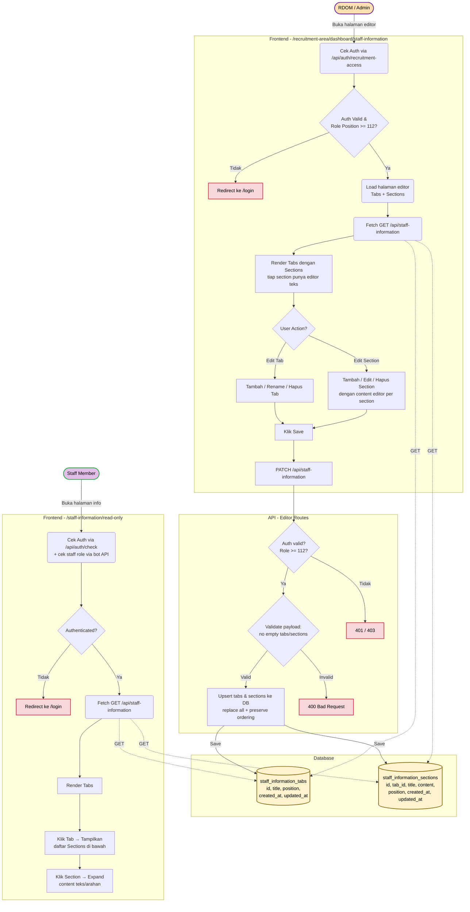

```mermaid
flowchart TD
    classDef user    fill:#e1bee7,stroke:#28a745,stroke-width:2px,color:#000
    classDef frontend fill:#d4edda,stroke:#28a745,stroke-width:2px,color:#000
    classDef backend  fill:#cce5ff,stroke:#0056b3,stroke-width:2px,color:#000
    classDef database fill:#fff3cd,stroke:#856404,stroke-width:2px,color:#000
    classDef error    fill:#f8d7da,stroke:#dc3545,stroke-width:2px,color:#000
    classDef hr       fill:#ffe0b2,stroke:#6a1b9a,stroke-width:2px,color:#000
    classDef readonly fill:#e3f2fd,stroke:#1565c0,stroke-width:2px,color:#000

    %% ========================= RDOM EDITOR FLOW ========================= %%
    RDOM([RDOM / Admin]):::hr -->|Buka halaman editor| FE1

    subgraph Frontend_Editor [Frontend - /recruitment-area/dashboard/staff-information]
        FE1(Cek Auth via /api/auth/recruitment-access)
        FE2{Auth Valid &<br>Role Position >= 112?}
        FE3[Redirect ke /login]:::error
        FE4(Load halaman editor<br>Tabs + Sections)
        FE5(Fetch GET /api/staff-information)
        FE6[Render Tabs dengan Sections<br>tiap section punya editor teks]
        FE7{User Action?}
        FE8[Tambah / Rename / Hapus Tab]
        FE9[Tambah / Edit / Hapus Section<br>dengan content editor per section]
        FE10[Klik Save]
        FE11[PATCH /api/staff-information]

        FE1 --> FE2
        FE2 -- Tidak --> FE3
        FE2 -- Ya --> FE4 --> FE5 --> FE6 --> FE7
        FE7 -- Edit Tab --> FE8 --> FE10
        FE7 -- Edit Section --> FE9 --> FE10
        FE10 --> FE11
    end

    %% ========================= EDITOR API ========================= %%
    subgraph Backend_Editor [API - Editor Routes]
        BE1{Auth valid?<br>Role >= 112?}
        BE2{Validate payload:<br>no empty tabs/sections}
        BE3[Upsert tabs & sections ke DB<br>replace all + preserve ordering]

        FE11 --> BE1
        BE1 -- Tidak --> E1[401 / 403]:::error
        BE1 -- Ya --> BE2
        BE2 -- Invalid --> E2[400 Bad Request]:::error
        BE2 -- Valid --> BE3
    end

    %% ========================= DATABASE ========================= %%
    subgraph DB [Database]
        DB1[(staff_information_tabs\nid, title, position,\ncreated_at, updated_at)]:::database
        DB2[(staff_information_sections\nid, tab_id, title, content,\nposition, created_at, updated_at)]:::database
    end

    BE3 -->|Save| DB1
    BE3 -->|Save| DB2
    FE5 -.->|GET| DB1
    FE5 -.->|GET| DB2

    %% ========================= STAFF READ-ONLY FLOW ========================= %%
    Staff([Staff Member]):::user -->|Buka halaman info| RF1

    subgraph Frontend_ReadOnly [Frontend - /staff-information/read-only]
        RF1(Cek Auth via /api/auth/check<br>+ cek staff role via bot API)
        RF2{Authenticated?}
        RF3[Redirect ke /login]:::error
        RF4(Fetch GET /api/staff-information)
        RF5[Render Tabs]
        RF6[Klik Tab → Tampilkan<br>daftar Sections di bawah]
        RF7[Klik Section → Expand<br>content teks/arahan]

        RF1 --> RF2
        RF2 -- Tidak --> RF3
        RF2 -- Ya --> RF4 --> RF5 --> RF6 --> RF7
    end

    RF4 -.->|GET| DB1
    RF4 -.->|GET| DB2
```
